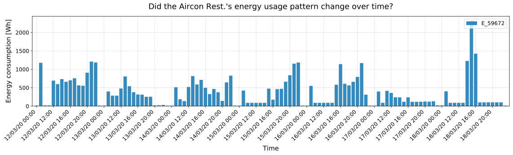
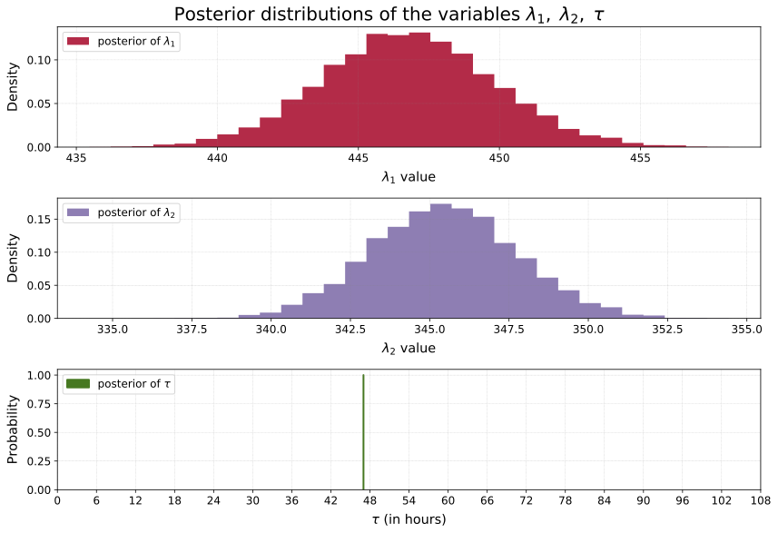

<h1 align=center>Change point detection in energy usage data using Bayesian inference</h1>

Zeliang Wang

### 1. Problem definition

In the context of building energy management, change point detection plays a very important role in modelling energy usage behaviour of monitored devices, and it is also a critical step in terms of developing the predictive maintenance functionality for Eniscope. We are curious to know if the energy usage patterns from a [Eniscope](https://best.energy/eniscope-ems/) monitored device have changed over time, either gradually or suddenly. Knowing the change points can inform (or alert) the users (clients) that something went wrong (or out of normal) in the circuit, e.g., Did the device break down or is it going to be failed anytime soon? or is it just a planned system shutdown? How can we build a model to automatically detect the change points?

To test our change point detection approach for Eniscope dataset, we have chosen Eniscope data recorded from the KFC store in Bracknell. To be more specific, the data we used here was from a Eniscope meter channel that was connected to a air conditioning unit in the store. In addition, we have chosen the period of time during which we know there already exist significant reductions of energy consumption due to the deployment of [ACE2](https://best.energy/air-conditioning-energy-saver/)(a type of energy conservation measure for air conditioning units). Therefore, there should exist a change point to be detected.

Before we start modelling, see what you can figure out just by looking at the figure below. Would you say there was a change in energy usage during this time period? 

Fig. 1. A chosen period of energy usage data of an air-conditioning unit from UK KFC in Bracknell, with non-working hours data removed.

### 2. Modelling

How can we start to model this? Intuitively, a Poisson random variable could be an appropriate model, but it requires the modelled variable being non-negative integer values, such as *count* data. That being said, we can simply round the energy data into integer values, as this won't affect our results in terms of detecting the change point.  Also, the rounded data will have a maximum of $1~Wh$ deviation from its real value, which is acceptable within this context. As we are using hourly energy data, let's denote hour $i$'s energy consumption by $C_i$, and it satisfies a Poisson distribution given by
$$
C_i \sim \text{Poisson}(\lambda)\;,
$$
where $\lambda$ is the parameter of the distribution, aka. *intensity* of the Poisson distribution. A Poisson distribution has a useful property that its expected value is equal to its parameter, i.e., $E[C_i|\lambda] = \lambda$. 

We are not sure what the value of the $\lambda$ parameter really is, however. Looking at Fig. 1, it appears that the energy usage drops a lot in the later stage, which is equivalent to saying that $\lambda$ decreases at some point during the observations. How can we represent this observation mathematically? Let's assume that at some point $\tau$ during the observation period, the parameter $\lambda$ suddenly drops to a smaller value. Now we have two $\lambda$ parameters: one for the period before $\tau$, and one for the rest of the observation period such that 
$$
\lambda = 
\begin{cases}
\lambda_1  & \text{if } t \lt \tau \cr
\lambda_2 & \text{if } t \ge \tau
\end{cases}\;.
$$

If in reality no sudden change occurred, i.e., $\lambda_1 = \lambda_2$, then their posterior distributions should look about the same.

We are interested in inferring the unknown $\lambda_1$ and $\lambda_2$. To use Bayesian inference, we need to assign prior probabilities to the different possible values of $\lambda$. What would be good prior probability distributions for $\lambda_1$ and $\lambda_2$? As $\lambda_i$ can be any positive number, the *exponential* distribution might be a good choice for modelling $\lambda_i$.
$$
\begin{align}
&\lambda_1 \sim \text{Exp}( \gamma ) \,, \\
&\lambda_2 \sim \text{Exp}( \gamma )
\end{align}
$$
where $\gamma$ is the parameter of the distribution, also called the *rate* parameter. Given a specific $\gamma$, the expected value of an exponential random variable $\lambda_i$ is given by $E[\lambda_i|\gamma] = \frac{1}{\gamma}$. Our initial guess at $\gamma$ does not influence the model too strongly, so we have some flexibility in our choice.  A good rule of thumb is to set the exponential parameter $\gamma$ equal to the inverse of the average of the energy data, i.e.,
$$
\frac{1}{N}\sum_{i=1}^N \;C_i \approx E[\; \lambda \; |\; \gamma ] = \frac{1}{\gamma} \;\;\; \Rightarrow\;\;\; \gamma = \frac{1}{\frac{1}{N}\sum_{i=1}^NC_i} \;.
$$
As to the priori of $\tau$, we might say it should be somewhere in the middle of the chosen period based on Fig. 1. However, without loss of generality, we can assign a *uniform prior belief* to every possible hour. This is equivalent to saying
$$
\tau \sim \text{DiscreteUniform(0, N-1)}\;\;\;\Rightarrow\;\;\; P( \tau = k ) = \frac{1}{N}\;,
$$
where $N$ is the total number of samples of the energy data. Note that it doesn't matter how the prior distributions of the unknown parameters look like, the only thing we care about here is the posterior distributions of these parameters. 

### 3. Results

To compute the posterior distributions of the unknown parameters $\lambda_1, \lambda_2$ and $\tau$, we use a technique called Markov Chain Monte Carlo (MCMC) to approximate inference. This technique returns thousands of samples from the posterior distributions of the parameters, given a set of observations and prior beliefs. Specifically, Metropolis-Hastings algorithm was used to sample the posteriors. For the implementation of the model, we use the Python library called [PyMC3](https://docs.pymc.io/), a probabilistic programming language for Bayesian analysis. All the code used to produce the results in this study have been uploaded to my GitHub repository which can be accessed from [here](https://github.com/zeliangwang/change-point-detection).

The posterior distributions of $\lambda_1, \lambda_2$ and $\tau$ are illustrated in Fig. 3. Now we can check the uncertainty in our estimates. The wider the distribution, the less certain our posterior belief should be. Also, we can see what the plausible values for the parameters are: $\lambda_1$ is around $2455$ and $\lambda_2$ is around $338$. **Clearly, the posteriors for $\lambda_1$ and $\lambda_2$ are very distinct, which indicates that there was a change point in the energy usage behaviour of the air-conditioning unit.

Fig. 3 Posterior distributions of the unknown parameters $\lambda_1,\,\lambda_2$ and $\tau$.

Our analysis also returns a distribution for $\tau$ . As it is a discrete random variable, its posterior distribution assigns the probabilities to all possible values of $\tau$. We can see that there was a $100\%$ chance that the energy usage behaviour changed at hour $42$ for this particular data set. If in reality, there is no change occurred, or the change occurred gradually over time, the posterior distribution of $\tau$ would have been more spread out, reflecting that many hours were plausible candidates for $\tau$. Therefore, the best estimate of the parameter $\tau$ is $42$, which corresponds to the date and time of *3rd November 2019, 18:00*. This change point is in accordance with the installation date of *ACE2* for the air-conditioning unit in the KFC store. 

Now *what is the expected energy consumption at time* $t, \; 0 \le t \le N-1$ ? As the expected value of a Poisson variable is equal to its parameter $\lambda$. Therefore, the question is equivalent to *what is the expected value of $\lambda$ at time $t$*? Assuming $i$ represents the index of samples from posterior distributions. Given an hour $t$, we average over all possible $\lambda_i$ for that hour $t$, using  $\lambda_i = \lambda_{1,i}$ if $t<\tau_i$ (that is, if the change has not yet occurred), else we use $\lambda_i = \lambda_{2,i}$.

The results, as shown in Fig. 4, demonstrate the influence of the change point. Clearly, there is no uncertainty for the expected consumption, which is something we probably like to see. Our analysis shows strong support for believing the energy usage behaviour did change, and that the change was sudden rather than gradual (as demonstrated by $\tau$'s strongly peaked posterior distribution). We can speculate what might have caused this. In fact, this is due to the installation of energy conservation measures.

Fig. 4 Estimated change point of the energy usage behaviour for an air-conditioning unit.

### 4. Future work

* In this study, we use the same priors for both $\lambda$s. Alternatively, we can also have two priors: one for each $\lambda_i$. Creating two exponential distributions with different $\gamma$ values reflects our prior belief that the energy usage changed at some point during the observations.
* We are also interested in how this model can be extended to more than a single change point. We will start extending this model by considering two change points.
* We will also try to model the energy data with a Gamma distribution. On one hand, the Eniscope data might be more close to a Gamma distribution. On the other hand, this can avoid the step of rounding the energy data in order to fit a Poisson distribution in the current model. However, this also imposes more complexities to the model, as there are more parameters to be estimated.