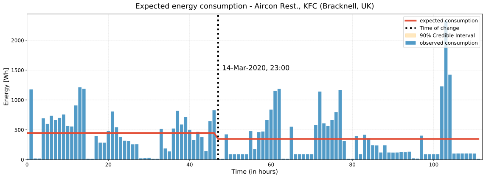

## Change point detection in energy consumption using Bayesian inference

In the context of building energy management, change point detection plays a very important role in modelling energy usage behaviour of monitored devices, and it is also a critical step in terms of developing the predictive maintenance functionality for Eniscope. We are curious to know if the energy usage patterns from a Eniscope monitored device have changed over time, either gradually or suddenly. Knowing the change points can inform (or alert) the users (clients) that something went wrong (or out of normal) in the circuit, e.g., Did the device break down or is it going to be failed anytime soon? or is it just a planned system shutdown? How can we build a model to automatically detect the change points? 

*** 
## Result snapshots 

